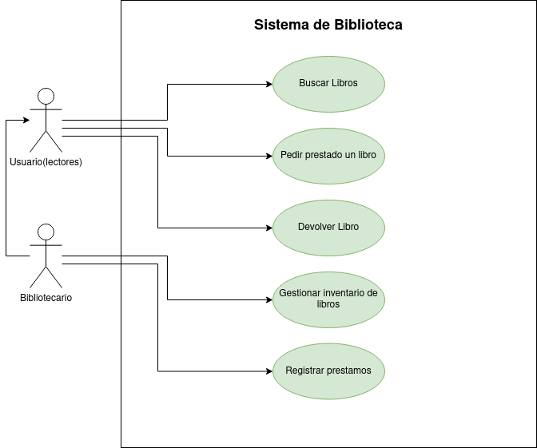

# tarea-diagramas
## Ejercicio 1: Biblioteca

|  Actor | Lector |
|---|---|
| Descripción  | _Es un usuario que puede realizar algunas acciones_  |
| Características  | __ |
| Relaciones | _Registrar prestamo, devolver libro_  |
| Referencias | _Buscar libro,pedir prestado un libro, devolver libro_ |
|  Notas |  __ |
| Autor  | _Alejandro Salazar Gonzalez_ |
|Fecha | _6/11/2024_ |

|  Atributo |||
|---|---|---|
| _Nombre_  | _Descripción_  | _Tipo_ |
| | |

---

|  Actor | Bibliotecario |
|---|---|
| Descripción  | _Es el administrador de la biblioteca_  |
| Características  | __ |
| Relaciones | _Registrar prestamo, devolver libro_  |
| Referencias | _Buscar libro,pedir prestado un libro, devolver libro, Gestionar inventario de libros, registrar prestamos_ |
|  Notas |  __ |
| Autor  | _Alejandro Salazar Gonzalez_ |
|Fecha | _6/11/2024_ |

|  Atributo |||
|---|---|---|
| _Nombre_  | _Descripción_  | _Tipo_ |
| | |

---

|  Caso de Uso	CU | Buscar libro  |
  |---|---|
  | Fuentes  | _[Documento]()_  |
  | Actor  |  _Lector, Bibliotecario_ |
  | Descripción | _El actor busca un libro en la biblioteca_  |
  | Flujo básico | __ |
  | Pre-condiciones | __  |
  | Post-condiciones  | __  |
  |  Requerimientos | __  |
  |  Notas |  __ |
  | Autor  | _Alejandro Salazar González_ |
  |Fecha | _6/11/2024_ |

  |  Caso de Uso	CU | Pedir Prestamo |
  |---|---|
  | Fuentes  | _[Documento]()_  |
  | Actor  |  _Lector, Bibliotecario_ |
  | Descripción | _El actor pide un libro en la biblioteca_  |
  | Flujo básico | __ |
  | Pre-condiciones | __  |
  | Post-condiciones  | __  |
  |  Requerimientos | __  |
  |  Notas |  __ |
  | Autor  | _Alejandro Salazar González_ |
  |Fecha | _6/11/2024_ |

  ---

  |  Caso de Uso	CU | Devolver un libro  |
  |---|---|
  | Fuentes  | _[Documento]()_  |
  | Actor  |  _Lector, Bibliotecario_ |
  | Descripción | _El actor devuelve un libro de la biblioteca_  |
  | Flujo básico | __ |
  | Pre-condiciones | _Haber pedido un libro anteriormente_  |
  | Post-condiciones  | __  |
  |  Requerimientos | __  |
  |  Notas |  __ |
  | Autor  | _Alejandro Salazar González_ |
  |Fecha | _6/11/2024_ |

  ---

  |  Caso de Uso	CU | Buscar libro  |
  |---|---|
  | Fuentes  | _[Documento]()_  |
  | Actor  |  _Lector, Bibliotecario_ |
  | Descripción | _El actor busca un libro en la biblioteca_  |
  | Flujo básico | __ |
  | Pre-condiciones | __  |
  | Post-condiciones  | __  |
  |  Requerimientos | __  |
  |  Notas |  __ |
  | Autor  | _Alejandro Salazar González_ |
  |Fecha | _6/11/2024_ |

  ---

  |  Caso de Uso	CU | Gestionar inventario de libros  |
  |---|---|
  | Fuentes  | _[Documento]()_  |
  | Actor  |  _Bibliotecario_ |
  | Descripción | _El actor modifica el inventario de la biblioteca_  |
  | Flujo básico | __ |
  | Pre-condiciones | __  |
  | Post-condiciones  | __  |
  |  Requerimientos | __  |
  |  Notas |  __ |
  | Autor  | _Alejandro Salazar González_ |
  |Fecha | _6/11/2024_ |

  ---

  |  Caso de Uso	CU | Registrar préstamos  |
  |---|---|
  | Fuentes  | _[Documento]()_  |
  | Actor  |  _Bibliotecario_ |
  | Descripción | _El actor registra el prestamo de un libro_  |
  | Flujo básico | __ |
  | Pre-condiciones | __  |
  | Post-condiciones  | __  |
  |  Requerimientos | __  |
  |  Notas |  __ |
  | Autor  | _Alejandro Salazar González_ |
  |Fecha | _6/11/2024_ |

  ## Ejercicio 2: Sistema de Compras en Línea
  
  
|  Actor | Cliente |
|---|---|
| Descripción  | _Es un usuario que puede realizar algunas acciones_  |
| Características  | __ |
| Relaciones | __  |
| Referencias | _Buscar productos, añadir productos al carrito, realizar pedido, realizar pago_ |
|  Notas |  __ |
| Autor  | _Alejandro Salazar Gonzalez_ |
|Fecha | _6/11/2024_ |

|  Atributo |||
|---|---|---|
| _Nombre_  | _Descripción_  | _Tipo_ |
| | |

---

|  Actor | Administrador |
|---|---|
| Descripción  | _Es un usuario que gestiona el sistema_  |
| Características  | __ |
| Relaciones | __  |
| Referencias | _Buscar productos, añadir productos al carrito, realizar pedido, realizar pago, gestionar catálogo de productos_ |
|  Notas |  __ |
| Autor  | _Alejandro Salazar Gonzalez_ |
|Fecha | _6/11/2024_ |

|  Atributo |||
|---|---|---|
| _Nombre_  | _Descripción_  | _Tipo_ |
| | |

---

  |  Caso de Uso	CU | Buscar productos  |
  |---|---|
  | Fuentes  | _[Documento]()_  |
  | Actor  |  _Usuario, administrador_ |
  | Descripción | _El actor busca un producto en el sistema_  |
  | Flujo básico | __ |
  | Pre-condiciones | __  |
  | Post-condiciones  | __  |
  |  Requerimientos | __  |
  |  Notas |  __ |
  | Autor  | _Alejandro Salazar González_ |
  |Fecha | _6/11/2024_ |

  ---

  |  Caso de Uso	CU | Añadir productos al carrito  |
  |---|---|
  | Fuentes  | _[Documento]()_  |
  | Actor  |  _Usuario, administrador_ |
  | Descripción | _El actor agrega un producto a su lista de compra_  |
  | Flujo básico | __ |
  | Pre-condiciones | _Haber buscado un producto_  |
  | Post-condiciones  | __  |
  |  Requerimientos | __  |
  |  Notas |  __ |
  | Autor  | _Alejandro Salazar González_ |
  |Fecha | _6/11/2024_ |

  ---
  |  Caso de Uso	CU | Realizar pedido  |
  |---|---|
  | Fuentes  | _[Documento]()_  |
  | Actor  |  _Usuario, administrador_ |
  | Descripción | _El actor apide lo que hay en su lista de compra_  |
  | Flujo básico | __ |
  | Pre-condiciones | _Haber añadido un producto minimo al carrito_  |
  | Post-condiciones  | __  |
  |  Requerimientos | __  |
  |  Notas |  __ |
  | Autor  | _Alejandro Salazar González_ |
  |Fecha | _6/11/2024_ |

  ---

  |  Caso de Uso	CU | Realizar pago  |
  |---|---|
  | Fuentes  | _[Documento]()_  |
  | Actor  |  _Usuario, administrador_ |
  | Descripción | _El actor paga lo que hay en su lista de compra_  |
  | Flujo básico | __ |
  | Pre-condiciones | _Haber riealizado un pedido_  |
  | Post-condiciones  | __  |
  |  Requerimientos | __  |
  |  Notas |  __ |
  | Autor  | _Alejandro Salazar González_ |
  |Fecha | _6/11/2024_ |

  ---

  |  Caso de Uso	CU | Gestionar catálogo de productos  |
  |---|---|
  | Fuentes  | _[Documento]()_  |
  | Actor  |  _Usuario, administrador_ |
  | Descripción | _El actor paga lo que hay en su lista de compra_  |
  | Flujo básico | __ |
  | Pre-condiciones | _Haber riealizado un pedido_  |
  | Post-condiciones  | __  |
  |  Requerimientos | __  |
  |  Notas |  __ |
  | Autor  | _Alejandro Salazar González_ |
  |Fecha | _6/11/2024_ |

  ## Ejercicio 3: Sistema de gestion de cursos en linea

|  Actor | Estudiante |
|---|---|
| Descripción  | _Usuario comun del sistema_  |
| Características  | __ |
| Relaciones | __  |
| Referencias | _Inscribirse en curso, ver material del curso, realizar evaluaciones_ |
|  Notas |  __ |
| Autor  | _Alejandro Salazar Gonzalez_ |
|Fecha | _6/11/2024_ |

|  Atributo |||
|---|---|---|
| _Nombre_  | _Descripción_  | _Tipo_ |
| | |

---

|  Actor | Profesor |
|---|---|
| Descripción  | _Usuario administrador de los cursos_  |
| Características  | __ |
| Relaciones | _Realiza las mismas acciones del alumno más las especificas_  |
| Referencias | _Inscribirse en curso, ver material del curso, realizar evaluaciones, crear curso, calificar evaluacion, actualizar contenido del curso_ |
|  Notas |  __ |
| Autor  | _Alejandro Salazar Gonzalez_ |
|Fecha | _6/11/2024_ |

|  Atributo |||
|---|---|---|
| _Nombre_  | _Descripción_  | _Tipo_ |
| | |

---

  |  Caso de Uso	CU | Inscribirse en curso  |
  |---|---|
  | Fuentes  | _[Documento]()_  |
  | Actor  |  _Estudiante, profesor_ |
  | Descripción | _El usuario se inscribe a un curso_  |
  | Flujo básico | __ |
  | Pre-condiciones | __  |
  | Post-condiciones  | __  |
  |  Requerimientos | __  |
  |  Notas |  __ |
  | Autor  | _Alejandro Salazar González_ |
  |Fecha | _6/11/2024_ |

  |  Caso de Uso	CU | Ver material del curso  |
  |---|---|
  | Fuentes  | _[Documento]()_  |
  | Actor  |  _Estudiante, profesor_ |
  | Descripción | _El usuario ve el material del curso_  |
  | Flujo básico | __ |
  | Pre-condiciones | _estar en el curso_  |
  | Post-condiciones  | __  |
  |  Requerimientos | __  |
  |  Notas |  __ |
  | Autor  | _Alejandro Salazar González_ |
  |Fecha | _6/11/2024_ |

  |  Caso de Uso	CU | Realizar evaluaciones  |
  |---|---|
  | Fuentes  | _[Documento]()_  |
  | Actor  |  _Estudiante, profesor_ |
  | Descripción | _El usuario realiza evaluaciones_  |
  | Flujo básico | __ |
  | Pre-condiciones | _Estar en un curso_  |
  | Post-condiciones  | __  |
  |  Requerimientos | __  |
  |  Notas |  __ |
  | Autor  | _Alejandro Salazar González_ |
  |Fecha | _6/11/2024_ |

  |  Caso de Uso	CU | Crear curso  |
  |---|---|
  | Fuentes  | _[Documento]()_  |
  | Actor  |  _Profesor_ |
  | Descripción | _El usuario crea un curso_  |
  | Flujo básico | __ |
  | Pre-condiciones | __  |
  | Post-condiciones  | __  |
  |  Requerimientos | __  |
  |  Notas |  __ |
  | Autor  | _Alejandro Salazar González_ |
  |Fecha | _6/11/2024_ |

  |  Caso de Uso	CU | Calificar evaluaciones  |
  |---|---|
  | Fuentes  | _[Documento]()_  |
  | Actor  |  _Profesor_ |
  | Descripción | _El usuario califica evaluaciones_  |
  | Flujo básico | __ |
  | Pre-condiciones | __  |
  | Post-condiciones  | __  |
  |  Requerimientos | __  |
  |  Notas |  __ |
  | Autor  | _Alejandro Salazar González_ |
  |Fecha | _6/11/2024_ |

  |  Caso de Uso	CU | Actualizar contenido del curso  |
  |---|---|
  | Fuentes  | _[Documento]()_  |
  | Actor  |  _Profesor_ |
  | Descripción | _El usuario cambia el contenido del curso_  |
  | Flujo básico | __ |
  | Pre-condiciones | _Que exista un curso_  |
  | Post-condiciones  | __  |
  |  Requerimientos | __  |
  |  Notas |  __ |
  | Autor  | _Alejandro Salazar González_ |
  |Fecha | _6/11/2024_ |